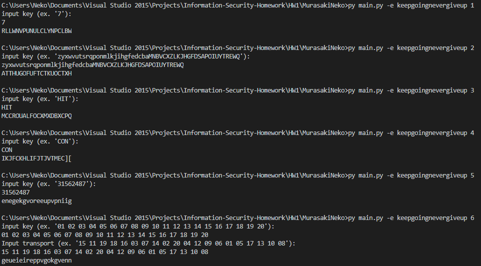

# HW1 B10415041 曾增宇

## 分組及分工

- B10415041 曾增宇
  - 加密
- B10415049 陳祐丞
  - 解密

## 建置環境

- Python 3.7.0 :: Anaconda, Inc. on windows 10

## 使用方式

- 命令列輸入 `main.exe -d <ciphertext> <method>` or `python main.py-d <ciphertext> <method>`
  ```
  <method>:
          1.Caesar
          2.Monoalphabetic
          3.Playfair
          4.Vernam
          5.RowTransposition
          6.Product
  ```

* 之後依據方法輸入各種 key

## 截圖



## 備註

我們兩個人的 code 都有自己寫加解密，助教可以看我程式中加密的部分就好
