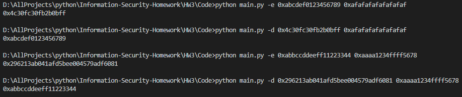

# HW3

## 分組及分工
* B10415041 曾增宇
    * 加密
    * IP, PC-1 ... 抄寫
    * 置換演算法
    * f-function
* B10415049 陳祐丞
    * 解密
    * SBox 抄寫
    * round-key function
    * main function
    

## 建置環境
* Python 3.6.5 :: Anaconda, Inc. on windows 10

## 使用方式
* 命令列輸入 ```python main.py -e <plaintext> <key>``` or ```python main.py -d <ciphertext> <key>```
* 明文、密文、key 輸入 16 進制，ex ```0x1234567890abcdef``` or ```1234567890abcdef```
## 實作過程困難與心得
* 在加密的過程中 最後一次 round-key 使用完的結果忘了左右對調一次，解密最初也忘記了，找了好久才發現。
* 非 64 bit 的補 0 還蠻重要的
* DES 每個步驟都還算是簡單，但組合起來非常繁複。

## 截圖
