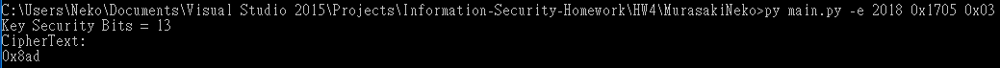

# HW4

## 建置環境

- Python 3.6.5 :: Anaconda, Inc. on windows 10

## 使用方式

- 輸入格式說明:  
  僅有 plaintext、ciphertext 可以輸入 10、16 進制的數值，ex `2018` or `0x7e2`  
  其餘如 p、q、key 等等皆須輸入 16 進制的數值，長度不限  
  輸出皆為 16 進制
- 加密:

1. 不指定 Key，命令列輸入`python main.py -e <plaintext>`  
    (Key 為自動隨機產生共 1024bits p=512bits q=513bits，質數驗證進行 20 次 Miller Rabin Test)

   

2. 使用 public key 進行加密，命令列輸入`python main.py -e <plaintext> <n> <public key>`

   

3. 使用兩個質數與 public key ，  
   命令列輸入`python main.py -e <plaintext> <prime p> <prime q> <public key>`

   

- 解密:

1. 使用 private key 進行解密(僅有 Square & multiply)，  
   命令列輸入`python main.py -d <ciphertext> <n> <private key>`  
   (這裡用上面自動產生的 key 做示範)  
   
2. 使用兩個質數與 private key 進行解密(中國餘式定理)，  
   命令列輸入`python main.py -d <ciphertext> <prime p> <prime q> <private key>`

   

## 實作過程困難與心得

- 在撰寫的過程中，在做平方時最後忘記除以模數，以至於算到後面數字很大，嚴重影響效能，還以為是加速不夠，幸好最後有發現!
- 在設計輸入輸出時也遇到一些問題，例如要輸入哪些資訊來進行加解密比較合理、或者是要輸入 16 進制的值還是 10 進制也煩惱了一陣子。
