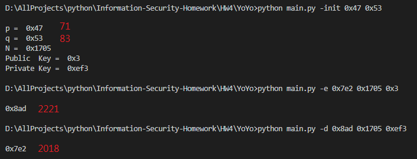
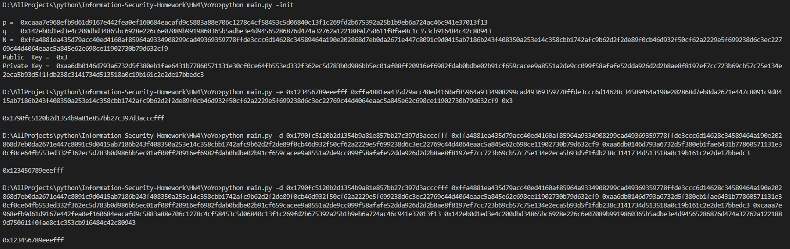

# HW4

## 建置環境

- Python 3.6.5 :: Anaconda, Inc. on windows 10

## 使用方式

* 命令列輸入 ```python main.py -init <NumOfBit>``` 建立 RSA key 相關資訊，無輸入```<NumOfBit>``` 預設為 1024 bit
* 命令列輸入 ```python main.py -init <prime1> <prime2>``` 用質數建立 RSA key 相關資訊
* 命令列輸入 ```python main.py -e <text> <N> <key> ``` 使用加密
* 命令列輸入 ```python main.py -d <text> <N> <key> ``` 使用解密
* 命令列輸入 ```python main.py -d <text> <N> <key> <p> <q>``` 快速解密
* 其實加解密都一樣，所以 ```-d``` or ```-e``` 都沒關係
* 明文、密文、N、key、p、q 輸入 16 進制，ex ```0x1234567890abcdef``` or ```1234567890abcdef```

## 實作部分
1. 小數字 RSA 加解密
    * ./RSA.py
2. 1024 bit RSA
    * ./RSA.py
3. 產生大質數
    * ./RandPrime.py
4. Square & multiply
    * ./SquareAndMultiply.py
5. Chinese Remainder Theorem 
    * ./RSA.py

## 實作過程困難與心得
* 在實作大質數時，發現時產生出來的數字竟然有偶數，於是在 Miller–Rabin 前面加上了已知小質數的判斷
* 有一次不小心隨機出兩個相同的質數，導致計算結果不一樣，後來讓他們大小差 1 bit 就永遠不會不一樣了
* 實作中國餘式定理時，因取 mod 自己筆記的方式有點不樣，導致公式有點錯亂，算出錯誤的值

## 截圖

