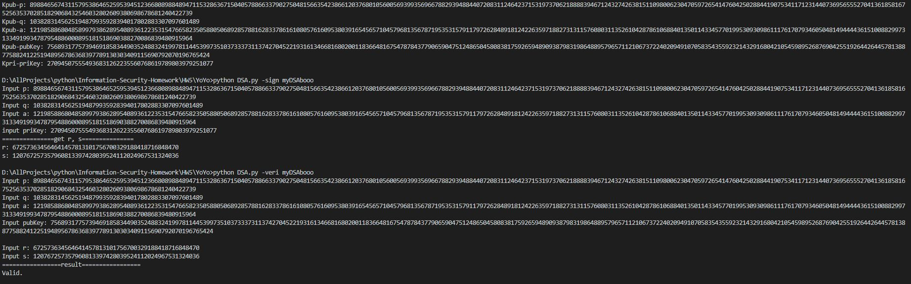

# HW5

## 分組及分工

- B10415041 曾增宇
  - 生成 key
  - 簽章
- B10415049 陳祐丞
  - 生成 key
  - 驗章

## 建置環境

- Python 3.6.5 :: Anaconda, Inc. on windows 10

## 使用方式

- 命令列輸入 `python DSA.py -keygen` 生成 key
- 命令列輸入 `python DSA.py -sign <message>` 再輸入相關 key 簽章，得 r, s
- 命令列輸入 `python DSA.py -veri <message>` 再輸入相關 key 及 r, s，驗章

## 實作過程困難與心得

- 一開始依照上課簡報的敘述一樣先找到 1024 bits 的 p，但是一直 random 不出 160 bits 又可以整除 p-1 的 q，後來想到 q 可能根本不存在，因此後來與同學、隊友討論後決定先找 p，再乘出 p 來判斷 p 是否為質數
- 產生完 key 後再檢查簽章發現模反元素寫錯了，後來才想到應該要用歐拉定理算才正確。

## 截圖

