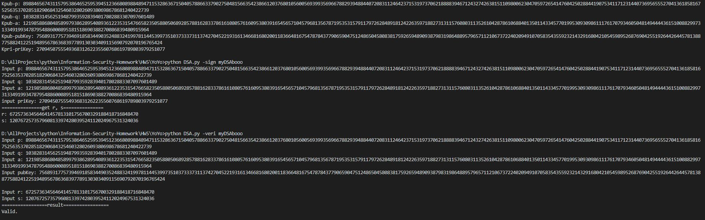

# HW5

## 分組及分工
* B10415041 曾增宇
    * 生成 key
    * 簽章
* B10415049 陳祐丞
    * 生成 key
    * 驗章

## 建置環境
* Python 3.6.5 :: Anaconda, Inc. on windows 10

## 使用方式
* 命令列輸入 ```python DSA.py -keygen``` 生成 key
* 命令列輸入 ```python DSA.py -sign <message>``` 再輸入相關 key 簽章，得 r, s
* 命令列輸入 ```python DSA.py -veri <message>``` 再輸入相關 key 及 r, s，驗章

## 實作過程困難與心得
* key 的生成中，p, q 很難找到，原本的做法是 random 質數p，再 random 質數q，看 q 是否為 p 的因數，後來決定先找 q，再找 q 的倍數在1024bit的數是否為質數，一方面用加法的也比較快
* 剛開始簽章驗章失敗，忘記了 -1 次方的 mod 值，要應用到歐拉定理，找 p - 2 次方
* 原理有點困難，不過看著實作方法寫 code 倒是滿簡單的，之前也實做過相關的 function 所以滿容易的。

## 截圖
